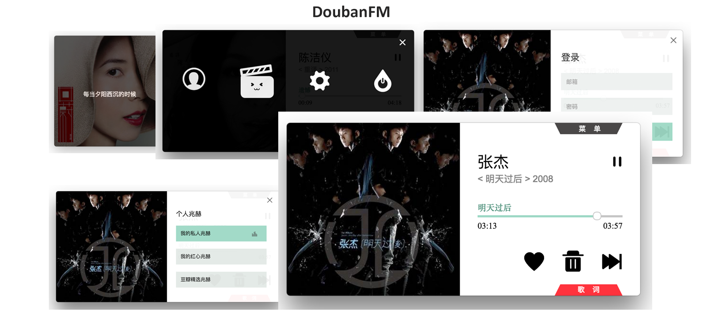

# DoubanFM

DoubanFM是一款使用豆瓣FM API和electron编写的桌面级APP。

## 程序截图



## API

关于豆瓣FM的API可以参阅[此处](https://github.com/akfish/fm-terminal/blob/develop/douban-fm-api.md)

## electron

Electron 是一款可以利用 Web技术 开发跨平台桌面应用的框架，最初是 Github 发布的 Atom 编辑器衍生出的 Atom Shell，后更名为 Electron，详情请点击[这里](http://electron.atom.io/)。

## 安装运行

可使用下面命令一键安装并执行程序:

```bash
npm install && npm start
```

## 功能特点

- [x] 基本播放功能
- [x] 进度条拖动
- [x] 频道选择
- [x] 用户登录
- [x] 歌曲收藏
- [x] 歌曲剔除
- [x] 快捷键
- [ ] 音效设置
- [x] 歌词同步
- [ ] 均衡器调节

## 快捷键
`Space` 播放/暂停

`Ctrl` + `d` 跳过当前歌曲

`Ctrl` + `n` 下一首歌曲

`Ctrl` + `l` 显示/隐藏登陆界面 

`Ctrl` + `u` 标记/取消标记爱心

`Ctrl` + `s` 显示/隐藏歌词

`Ctrl` + `q` 退出当前程序

`Ctrl` + `Shift` + `m` 显示/隐藏菜单

## 打包发布

* Windows

* MacOS


## TODO
- ~~修复程序部分区域拖动无法移动问题~~
- 修复lrc歌词展示不准确问题
- 添加音乐均衡器，实现不同音效的设置
- ~~为播放器添加快捷键设置~~
- 界面优化与代码重构
- 爬虫抓取豆瓣FM的频道类别

## LICENSE

DoubanFM is licensed under The MIT License.

MIT: [http://rem.mit-license.org](http://rem.mit-license.org)